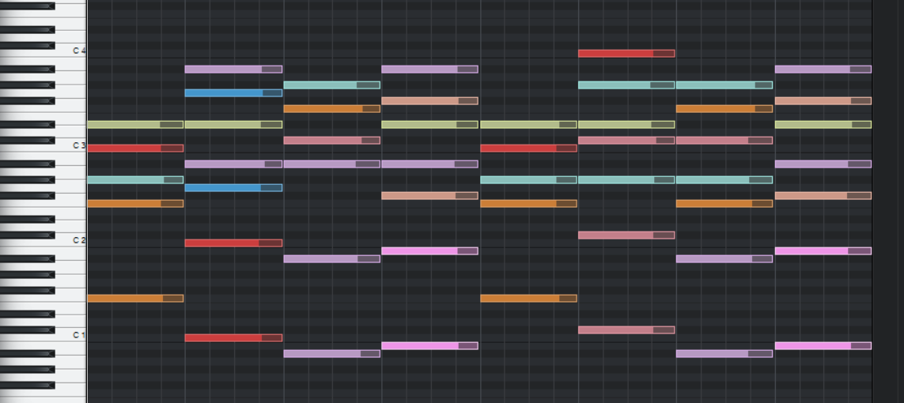
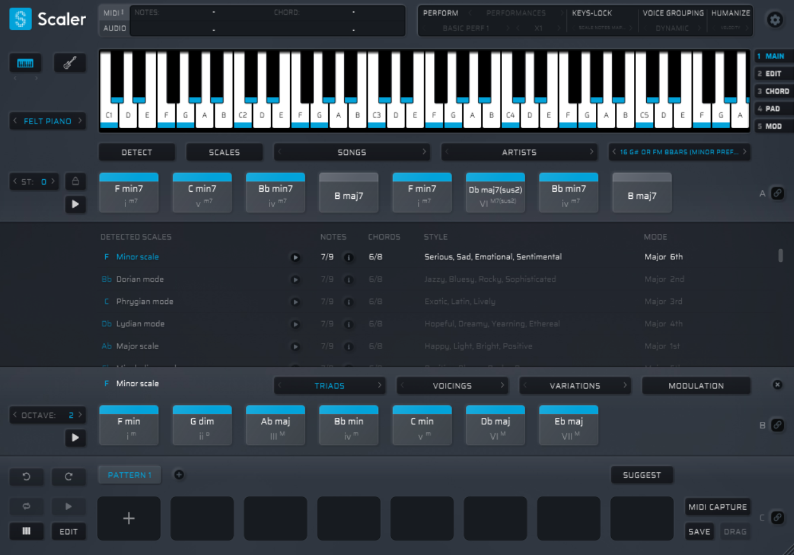

# Midi to Scaler chord sets

Convert chord progressions from midi files to Plugin Boutique's Scaler 2 sets.

## Example

Go to the `examples` folder to see a converted midi file like this one:

  
   
  <i>Original midi file</i>
  

  
   
  <i>Converted chord set loaded in Scaler 2</i>

## How to use

Be sure to have [Node.js](https://nodejs.org/en/download/) installed, then:

- [Download](https://github.com/joanroig/midi-to-scaler-chord-sets/archive/refs/heads/main.zip) or clone the repo.
- Run `npm install` in the root folder to install dependencies.
- Group your .mid or .midi files in folders and add them to the `midis` folder. Each folder will be converted to a set.
- Run `npm run convert` to run the conversion.
- The converted files should be in the `sets` folder, copy each folder set to the custom sets folder and start using them:
  - Windows path: `C:/Users/Public/Documents/Plugin Boutique/Scaler2/Sets`
  - MacOS path: `/Users/Shared/Plugin Boutique/Scaler2/Sets`

## Configuration

The input, output and threshold for chord detection can be changed in: [config.json](config.json)

### Configuration parameters

- **threshold:** time interval in MIDI ticks to determine the maximum amount of time between note-on and note-off events for the events to be considered part of the same chord.
- **inFolderPath:** folder used to read the midi files, it must contain subfolders with the midi files for each set. The name of each subfolder will name the set.
- **outFolderPath:** folder used to save the converted sets.
